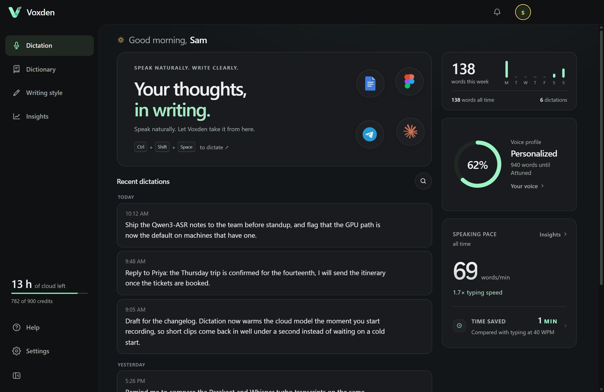
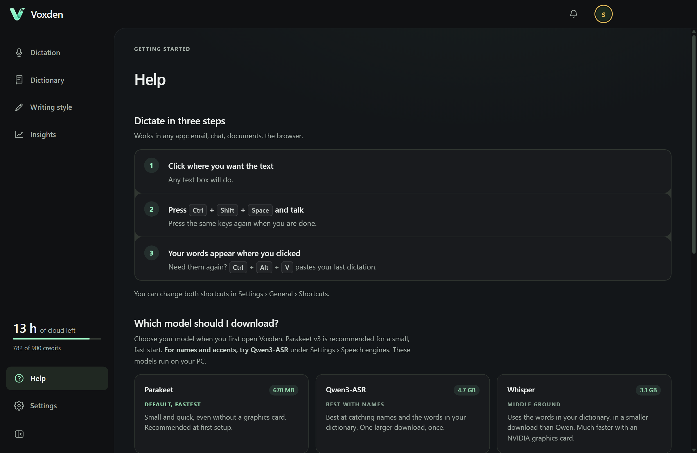
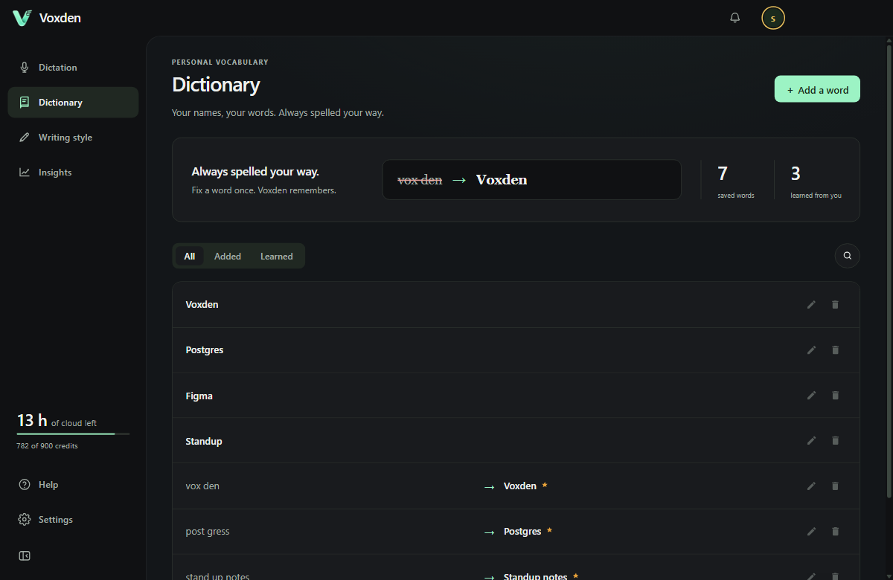
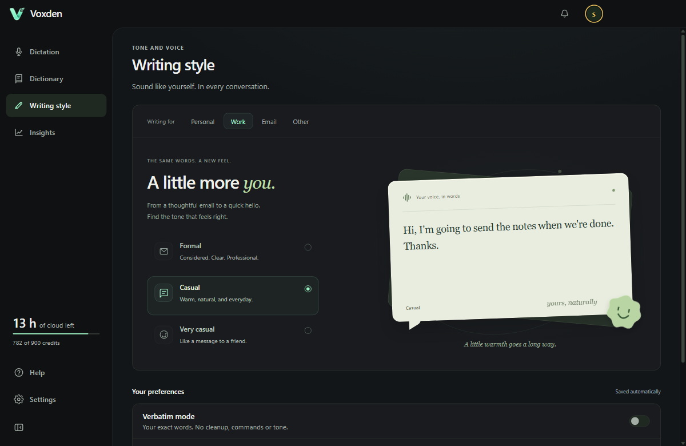
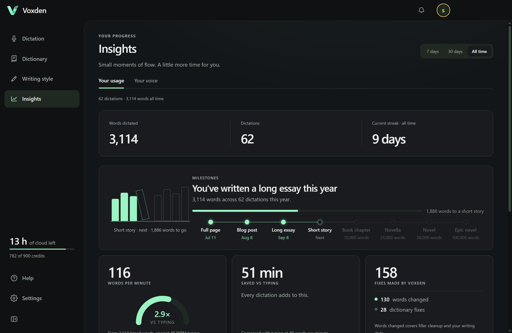
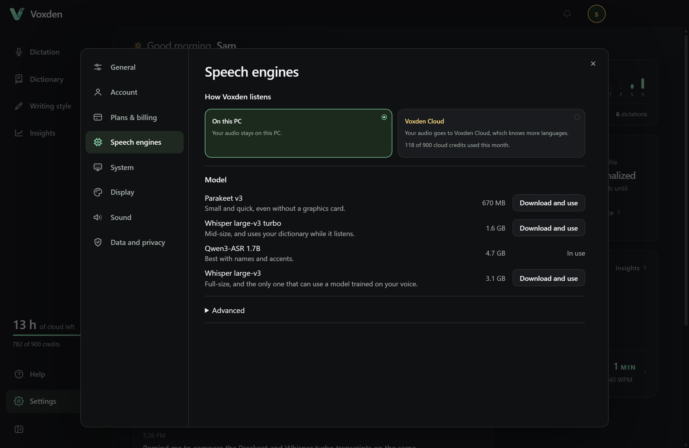

<p align="center">
  
</p>

<h1 align="center">Voxden</h1>

<p align="center">
  <b>Dictation for Windows that runs on your own PC.</b><br>
  Press a key, talk, and the text lands in whatever app you were typing in.<br>
  Free for 3,000 words a week. Your audio stays on your PC unless you turn on Voxden Cloud.
</p>

<p align="center">
  <a href="https://github.com/sounak1125/voxden/releases/latest"></a>
  <a href="https://github.com/sounak1125/voxden/releases/latest"></a>
  
  
</p>

<p align="center">
  <a href="https://github.com/sounak1125/voxden/releases/latest"><b>⬇ Download the installer</b></a>
</p>

<p align="center">
  
</p>

## Why Voxden

Tools like Wispr Flow and Dragon do this well, but they charge a monthly fee and send your voice to a server. Voxden does the same job on your own machine. The Free plan covers 3,000 words a week; Voxden Pro removes the limit and adds cloud dictation.

- **Works in every app.** Chat, email, the browser, your IDE, a terminal. If you can type there, you can dictate there.
- **Private by design.** Speech recognition, cleanup and grammar fixes run locally. Your audio leaves the PC only if you turn on Voxden Cloud, a Pro feature that is off by default.
- **Real speech models, not the Windows built-in one.** Pick from Qwen3-ASR, Whisper large-v3 or Parakeet. Strong on accents and mixed-language speech.
- **Learns your words.** Correct a transcript once and Voxden remembers the name, the product, the jargon. Those terms are fed to the model before it decodes.
- **Knows where you are typing.** Casual in WhatsApp, formal in Outlook. Fillers like "um" and "you know" are removed, spoken numbers become digits.
- **Nothing to set up.** One installer. No Python, no API keys, no Hugging Face account.

## How it works

<p align="center">
  
  <br><sub>The flow bar at rest, expanded on hover, and while recording.</sub>
</p>

1. **Click where you want the text.** Any text box in any app.
2. **Press `Ctrl` + `Shift` + `Space` and talk.** A small pill pops up at the bottom of the screen and shows your voice level.
3. **Press the same keys again.** Voxden transcribes, cleans up the sentence and pastes it where your cursor was.

That is the whole workflow. `Esc` cancels without pasting. `Ctrl` + `Alt` + `V` pastes your last dictation again. Open **Settings → General → Shortcuts → Change** to edit either shortcut. General also contains your microphone, dictation language, app language, dictation mode, and dictation speed.

There is also a small glowing bar at the bottom of the screen at all times. Click it to dictate, hover it for a settings button, drag it anywhere on any monitor. It remembers where you left it.

## Install

1. Download the installer from the [latest release](https://github.com/sounak1125/voxden/releases/latest) and run it. Windows 10 or 11, 64-bit.
2. If Windows shows a blue **"Windows protected your PC"** screen, click **More info**, then **Run anyway**. Voxden is not yet code-signed, so Microsoft SmartScreen flags the installer as unfamiliar. It is not a virus report. If your browser also blocks the download, choose **Keep** from its download menu.
3. On first launch, sign in with Google or an emailed code, then pick a speech model. Voxden downloads it for you and checks the file hash. You can switch models later in **Settings → Speech engines**.
4. Start dictating.

| Model | Download | Best for |
|---|---|---|
| **Parakeet TDT 0.6B** (default) | 670 MB | Fastest, and small enough that a fresh install dictates within minutes. |
| **Qwen3-ASR 1.7B** | 4.7 GB | Best at catching names and the words in your dictionary. |
| **Whisper large-v3** | 3.1 GB | Uses the words in your dictionary, smaller download than Qwen. The only model that can use a model trained on your voice. |

Dictation on your PC is in English with every model. Hindi, Hinglish and other languages need Voxden Cloud on a Pro plan.

Any modern PC runs Voxden on the CPU. An NVIDIA card makes Qwen and Whisper several times faster with an optional download from Settings. See [Speed it up with your graphics card](#speed-it-up-with-your-graphics-card).

<p align="center">
  
  <br><sub>The Help page inside the app walks a new user through the same steps.</sub>
</p>

## Features

### Capture: point, speak, and attach

Hover over the flow bar and click the capture-corners icon beside the microphone,
or choose **Capture screenshot…** from the tray menu.
Drag a region on any monitor, then use **Circle**, **Arrow**, **Pen**, or **Hide**
to mark the detail directly on the screenshot. Listening starts automatically,
so you can speak while marking. Press your normal dictation shortcut to stop;
Voxden pastes your words and the marked screenshot into your chat box, then
dismisses the capture. The small toolbar also has a stop button.

Capture remembers the app you were using. To use another destination, click its
message box before stopping dictation. The destination must support pasting images.
Voxden never sends the message automatically in Capture mode. If a paste fails,
the capture stays available and your shortcut retries it.

Press **Escape** to cancel, or use the retake icon to start a fresh capture.
Screenshots and annotations stay in memory until pasted or cancelled. Speech is
transcribed locally. Each selection stays within one monitor; captures do not
span displays.

### Dictionary: teach it your words once

Edit any transcript in the history and Voxden learns the correction. The next time you say "cooper netties" it writes Kubernetes. Terms are handed to the speech model before it decodes, so they come out right the first time rather than being patched afterwards. You can also add words by hand.

With **Settings → General → Extras → Auto-add to dictionary** enabled (the default),
correct a recently dictated word directly in a supported Windows text field.
After you pause typing, Voxden adds the corrected spelling and shows
**Added “Kubernetes” to dictionary** in the flow bar, with **Undo**. Undo removes
that addition without changing your text. Automatically learned spellings guide
the speech model; replacement rules can still be added explicitly in Dictionary.

This runs locally and watches only the field that received the latest dictation,
for up to 90 seconds. Switching fields/apps, clearing the field, starting another
dictation, or turning the setting off ends observation. Password, read-only,
unsupported and very large fields are skipped, as are dictations sent automatically.
Field contents stay in memory; only learned terms are saved. History edits still
offer replacement suggestions for review in Dictionary.

<p align="center">
  
</p>

### Writing style: casual in chat, formal in email

Voxden looks at which app is in front and picks a tone for it. Personal messages, work messages and emails each get their own setting. Filler words are removed, repeated words collapsed, spoken punctuation ("comma", "new paragraph") applied, and numbers written as digits. Turn on **Verbatim mode** to paste exactly what you said.

Enable **Auto cleanup** in Writing style for lightweight English proofreading with no extra model or download. It fixes common agreement and verb mistakes ("we was gonna go" → "We were gonna go."), punctuation spacing, sentence casing, and missing end punctuation. It preserves casual wording and applies your selected tone afterwards, so Very casual still uses lowercase and omits a final period. The option starts off, pauses in Verbatim mode, and leaves other dictation languages unchanged. It uses local rules; it does not restructure long sentences or resolve ambiguous grammar.

<p align="center">
  
</p>

### Insights: see how much you actually talk

Words per minute against typing speed, time saved, which apps you dictate into, and a streak calendar. All computed locally from your own history.

<p align="center">
  
</p>

### Settings

Change the shortcut, switch between toggle and push-to-talk, choose the speech engine and the processor it runs on, and decide whether other audio is silenced while you dictate.

In **Settings → Data and privacy**, use **Delete** beside **Keep recordings** to clear saved dictation audio. Transcripts, training clips, exported WAV files, and your choice to keep future recordings are preserved.

<p align="center">
  
</p>

### And the rest

- **Mute other audio while dictating.** Spotify and other Windows media sessions pause, while calls, videos, games, and other playback are silenced until the microphone closes. Music or output you muted yourself stays that way.
- **Spoken numbers become digits.** "twenty five percent" → 25%, "version one point zero point sixteen" → version 1.0.16, "the twenty fifth" → the 25th. Small bare numbers stay words where style guides want them ("two cats").
- **Voice commands.** new line, new paragraph, period, comma, question mark, scratch that.
- **What's new bell.** New engines and features are announced inside the app. Bug fixes are deliberately not announced.
- **Train on your own voice.** Optionally keep the audio behind dictations you correct, then fine-tune Whisper on it. Off by default, nothing is uploaded. See [Training on your own voice](#training-on-your-own-voice).

## Voxden vs Wispr Flow

| | Voxden | Wispr Flow |
|---|---|---|
| Price | Free for 3,000 words a week, or Voxden Pro; MIT licensed | Subscription |
| Where speech is processed | Your PC, or Voxden Cloud if you turn it on (Pro) | Their servers |
| Account required | Yes: Google or an emailed code | Yes |
| Works offline | Yes, on your PC's model | No |
| Platform | Windows | Windows, macOS, iOS |
| Speech models | Qwen3-ASR, Whisper, Parakeet, your own fine-tune | Cloud |
| Custom vocabulary | Yes, fed to the model before decoding | Yes |
| Per-app tone | Yes | Yes |

If you need a Mac or your phone, Wispr Flow is the better fit today. If you want the same thing on Windows with your voice kept on your own PC, that is what Voxden is for.

## Speed it up with your graphics card

You can skip this. Voxden works on any PC without it. If dictation feels slow, one extra download can speed up your model. Find these in **Settings → Speech engines**.

| Your hardware | What to do |
|---|---|
| NVIDIA card + Whisper | Choose **Download 553 MB** under **Speed up with your GPU** |
| NVIDIA card + Qwen3-ASR | Choose **Download** under **Speed up with your GPU** |
| AMD card + Qwen3-ASR | Choose **Download** under **Speed up with your GPU**. Only some AMD cards support it. |
| AMD or Intel graphics + Parakeet | Set **Processor** to **AMD or Intel GPU** under Settings → Speech engines → Advanced. This needs a separate 2.5 GB download. |
| Anything else | Leave **Processor** (Settings → Speech engines → Advanced) on **Auto**. |

Each pack speeds up one model only. On a strong CPU the gain can be small: on a 24-thread part Parakeet measured 17x realtime on the CPU against 15.9x on DirectML, so the GPU matters most where the CPU is the weak part.

## Run from source

```bash
npm install
npm start
```

Uses the system Node install. A source checkout picks up a Python environment in this order: `VOXDEN_PYTHON`, the downloaded speech engine if you installed one, `.venv/Scripts/python.exe`, then the system Python. Tests run with `npm test`.

Useful environment variables for development:

| Variable | Effect |
|---|---|
| `VOXDEN_PYTHON` | Point at a Python environment you maintain yourself, including a CUDA PyTorch one. Packaged builds never search system Python. |
| `VOXDEN_DEVICE` | `cpu`, `cuda`, `directml` or `auto`. Overrides the UI setting; unsupported backends fall back to CPU. |
| `VOXDEN_CPU_THREADS` | Override the CPU thread count (default: half the logical processors, capped at 16). |
| `VOXDEN_MODEL` | Use a specific model directory, for example your own fine-tune. |
| `VOXDEN_LAZY_ASR=1` | Defer loading the model until the first dictation instead of at startup. |

## Technical notes

Everything below is here for the curious and for contributors. None of it is needed to use the app.

<details>
<summary><b>Speech engines and the bundled runtime</b></summary>

The Windows installer includes a self-contained speech runtime with Whisper, Qwen3-ASR, Parakeet, CPU PyTorch, and DirectML. End users do not install Python, run pip, or need a Hugging Face account.

On first launch, **Set up dictation** downloads the model for the selected engine only. A fresh install selects Parakeet (~0.7 GB); **Download and use** on the Qwen3-ASR 1.7B row in Settings → Speech engines downloads it (~4.7 GB) and switches to it in one click. Whisper large-v3 (~3.1 GB) and the float32 Parakeet weights (~2.5 GB) are separate optional downloads. Existing app model caches are verified and reused where possible. Setup checks SHA-256, resumes interrupted downloads, and keeps completed models across updates.

Starting the app, switching engines, and dictation never download models in the managed runtime. Removing speech engines stops their processes and disables dictation; the window, history, and settings still work. Download again to reinstall. A normal launch opens the dashboard; launching with Windows stays in the tray.

Settings → Speech engines lists four local models, each with one button. Switching restarts the sidecar and releases the previous model before loading the next one.

**Voxden Cloud** (Settings → Speech engines → How Voxden listens, off by default, Pro only) sends each dictation's audio to Voxden's account service, which forwards it to a hosted speech model and meters the seconds against the plan's monthly cloud credits (one credit is one minute of audio). The app waits a few seconds at most; if the cloud is slow, unreachable, over the cap, or the account is not Pro, the dictation fails with the reason shown on the Voxden Cloud card. Switch How Voxden listens to On this PC to dictate locally. Audio leaves the PC only while this is on. The service and its relay live in [server/](server/README.md).

- **Parakeet TDT 0.6B v2** — the default on a fresh install; lightweight English model. When Whisper or Qwen is selected, Dictation speed Fast (and Auto in chat apps such as ChatGPT, Claude, Slack, Discord, WhatsApp) still uses Parakeet for lower latency. If Parakeet is missing, Fast uses the selected engine with a cheaper decode.
- **Qwen3-ASR 1.7B** — the download for names and dictionary terms, which it catches most often of the three ([measurements](docs/VOCABULARY_AND_ACCURACY.md)), through the official `qwen-asr` Transformers backend. A settings file from before the engine picker existed keeps whichever of Qwen or Whisper is already downloaded rather than reverting to Parakeet.
- **Whisper large-v3** — installed through `faster-whisper`; the mature alternative with word timings and confidence scores. CUDA float16 where available and CPU int8 otherwise.

This build includes CPU PyTorch, so Qwen works without extra downloads. Optional Qwen CUDA acceleration (NVIDIA) and Qwen ROCm acceleration (only AMD GPUs on AMD's Windows PyTorch list) are separate downloads. The Whisper cuBLAS pack does not accelerate Qwen. DirectML accelerates Parakeet only. Settings says Qwen3-ASR is using your GPU only after the sidecar verifies it, whatever Processor is set to.

The CPU path runs on half the logical processors, capped at 16. CTranslate2 uses four on its own whatever the machine has, which on a 12-core part measured 1.5x realtime against 4.2x with the cores it actually had.

Maintainer instructions for the speech engine and model release assets are in [docs/ASR_ASSETS_RELEASE.md](docs/ASR_ASSETS_RELEASE.md).
</details>

<details>
<summary><b>AMD and Intel graphics (DirectML)</b></summary>

Settings → Speech engines → Advanced → **Processor** offers **AMD or Intel GPU**, which runs Parakeet on ONNX Runtime's DirectML provider. DirectML targets DirectX 12 rather than a vendor, so one option covers Radeon, Intel integrated graphics and Arc.

**Auto does not pick it.** It stays CUDA-or-CPU. Nearly every PC has a DirectX 12 card, so ranking DirectML above the CPU would move most users onto a 2.5 GB download in place of a 0.7 GB one for a gain they may not have: on a 24-thread CPU the two measured 15.9x against 17.0x realtime. DirectML earns its place where the CPU is the weak part, which is a thing the person at the machine knows and `auto` does not.

Only Parakeet has that DirectML path. CTranslate2 has exactly one GPU backend and it is CUDA. Qwen3-ASR on AMD uses CPU PyTorch unless the GPU is on AMD's Windows ROCm PyTorch list and the separate Qwen ROCm pack is installed and verified. That list is short: it is not every Radeon. Whisper on a Radeon stays on the CPU. Settings offers no GPU speed-up for Whisper on a Radeon.

The GPU path drops quantization: DirectML gets the float32 weights (2.5 GB) rather than the int8 ones (0.7 GB), because the int8 build is a QDQ graph whose quantize/dequantize pairs cost a GPU more than they save. Measured on one DirectX 12 card, int8 on DirectML ran at 6.9x realtime against 15.9x for float32 and 17x for int8 on a 24-thread CPU. Each precision keeps its own directory under the model folder, so moving the setting between the CPU and a GPU does not throw the other download away.

DirectML arrived in speech engine `asr-win-x64-v2`. An older install has no DirectML provider, and Voxden says so and asks for a reinstall from Settings. On your own Python, `pip install onnxruntime-directml` instead of `onnxruntime` or `onnxruntime-gpu`. One ONNX Runtime build per environment, never two.
</details>

<details>
<summary><b>Startup, model loading and the paste helper</b></summary>

On launch, Voxden probes the speech runtime (a cheap import check) and then loads the selected model in the background a moment later, at below-normal process priority and with its CPU threads capped to half the logical processors, so the first dictation does not wait for a multi-gigabyte load and the desktop stays responsive while it happens. The engine also runs a short silent clip through itself before reporting ready, so the first real dictation is answered at full speed. Set `VOXDEN_LAZY_ASR=1` to defer the load until the first dictation instead.

The Windows helper that reads the foreground window, pastes, pauses music, and silences other playback runs as a small pool of long-lived PowerShell processes. Earlier builds started a new process for every call, and each one compiled the helper before answering, which cost about a quarter of a CPU second twice a second for the life of the app and put the paste a full second behind the transcript.

**Mute other audio while dictating** pauses supported Windows media sessions and mutes active playback devices before recording starts. This silences ordinary audio such as Discord calls even when it has no media controls. When the microphone closes, Voxden unmutes only devices it muted and resumes only media it paused; pre-existing mute and pause states stay untouched. Rapid dictations, cancellation, errors, and quit share the same ordered restore flow.
</details>

<details>
<summary><b>The flow bar</b></summary>

**Show flow bar at all times** (Settings, on by default) keeps a small glowing bar at the bottom of the screen. Hover it and it opens into a microphone with a settings button on the left and a drag handle on the right. Click the bar to dictate, the gear to open Voxden, or drag the handle to move the bar anywhere on any monitor. Where you drop it is remembered.

The bar keeps its position across restarts. If the monitor it was on goes away, it moves to the nearest one that is still there and returns when that screen comes back. **Reset position** in Settings puts it back at the bottom of your main display. Wherever the bar sits, dictation still pastes into the window that had focus, not into the screen the bar happens to be on.
</details>

<details>
<summary><b>Dictionary and vocabulary</b></summary>

Edits in history teach a local dictionary (`data/dictionary.json`). Future transcripts apply those replacements before paste (case-insensitive, longest phrase first, in any script). Learned phrases are listed on the Dictionary page; delete one with x.

Dictionary terms are also given to the speech engine before it decodes, through whatever input that engine actually has: Whisper takes them as `initial_prompt`, Qwen3-ASR as its `context` system message. Parakeet has no such input at all, so on that engine the dictionary is applied to the transcript afterwards and Voxden says so rather than pretending otherwise. Terms are ranked by how recently they were added and used and packed into each engine's own token budget, so a word you add now is in the very next dictation even if your dictionary is far larger than any prompt window.

An "accurate" dictation keeps its dictionary. Voxden will still switch to the faster engine on a CPU when there is nothing to lose, but not when that would mean dropping the terms you taught it.

Full detail, including how any of this is measured, is in [docs/VOCABULARY_AND_ACCURACY.md](docs/VOCABULARY_AND_ACCURACY.md).
</details>

<details>
<summary><b>Cleanup and numbers</b></summary>

Formal writing removes only unambiguous vocal fillers and punctuation-delimited asides. Ambiguous phrases such as "you know", "like", and "kind of" are preserved when they may carry meaning, so sentences such as "Do you know the answer?" and "I like this design" are never damaged by the deterministic fallback.

Spoken numbers are written as figures: "one point zero point sixteen" becomes 1.0.16, "twenty five percent" becomes 25%, "twenty twenty six" becomes 2026, "the twenty fifth" becomes the 25th, and "five five five one two three four" becomes 5551234. A bare "one" to "nine" stays a word ("one of them", "two cats") unless a unit or a label makes it a figure ("five percent", "page three", "version two"), which is what style guides ask for. **Write numbers as digits** in Settings → Writing style turns this off. Verbatim mode never rewrites numbers.
</details>

<details>
<summary><b>Notifications</b></summary>

The bell at the right of the title bar carries what is new: a new engine, a new language model, a feature that did not exist before, and an update that has finished downloading. A count under the bell says how many you have not looked at; opening the panel clears it. Rows stay until you dismiss one with x or use **Clear all**.

Bug fixes are deliberately not announced. A fresh install is told only what shipped in the version it installed, and updating tells you what landed in every version you skipped.

Announcements ship inside the app, in the catalog at the top of `src/announcements.js`. Add an entry with `since` set to the version it ships in; the id is permanent, because a dismissed id is remembered so it cannot come back.
</details>

<details>
<summary id="training-on-your-own-voice"><b>Training data and training on your own voice</b></summary>

Off by default. Turn on Settings → Data and privacy → **Keep audio for training** and Voxden keeps the recording behind any dictation you correct, paired with your corrected text. That pair is the only ground truth this app ever gets, and it is normally deleted the moment transcription returns.

Clips you never correct age out of a small pending window. Corrected ones land in `data/audio/corpus/` with a `data/audio/pairs.jsonl` manifest. Deleting a dictation deletes its recording; turning the setting off deletes all of them. Nothing is uploaded.

To see what has accumulated:

```bash
node scripts/export-training-data.js
```

Add `--write` to emit `train.jsonl` and `eval.jsonl` with absolute paths and a `sentence` key, ready for a Whisper fine-tune.

Once enough clips have accumulated, `training/` holds a LoRA fine-tune of Whisper on them, a CTranslate2 conversion step, and an evaluation that compares the result against stock large-v3 on held-out clips. See [training/README.md](training/README.md).

A finished model lands in `models/voxden-tuned/` and the app picks it up on its own; Settings → Speech engines → Advanced gets a **Use your tuned model** toggle while Whisper large-v3 is in use. `VOXDEN_MODEL` overrides both.
</details>

## Contributing and feedback

Found a bug, or a phrase Voxden keeps getting wrong? [Open an issue](https://github.com/sounak1125/voxden/issues). Pull requests are welcome. If Voxden saves you time, a star on the repo helps other people find it.

## License

MIT. Third-party notices are in [THIRD_PARTY_NOTICES.md](THIRD_PARTY_NOTICES.md).
